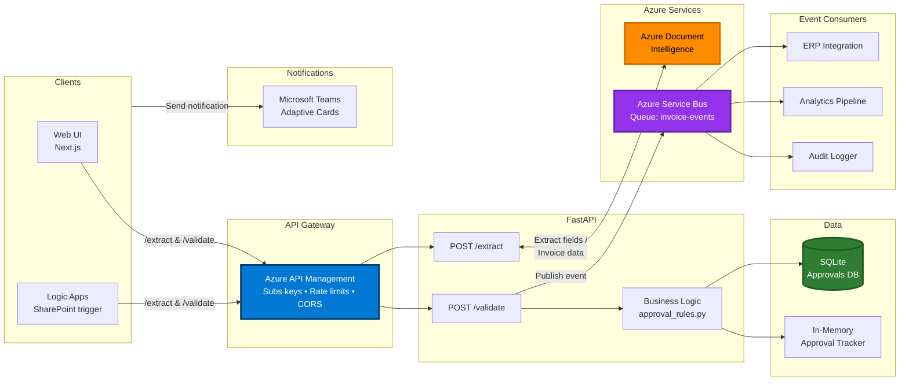
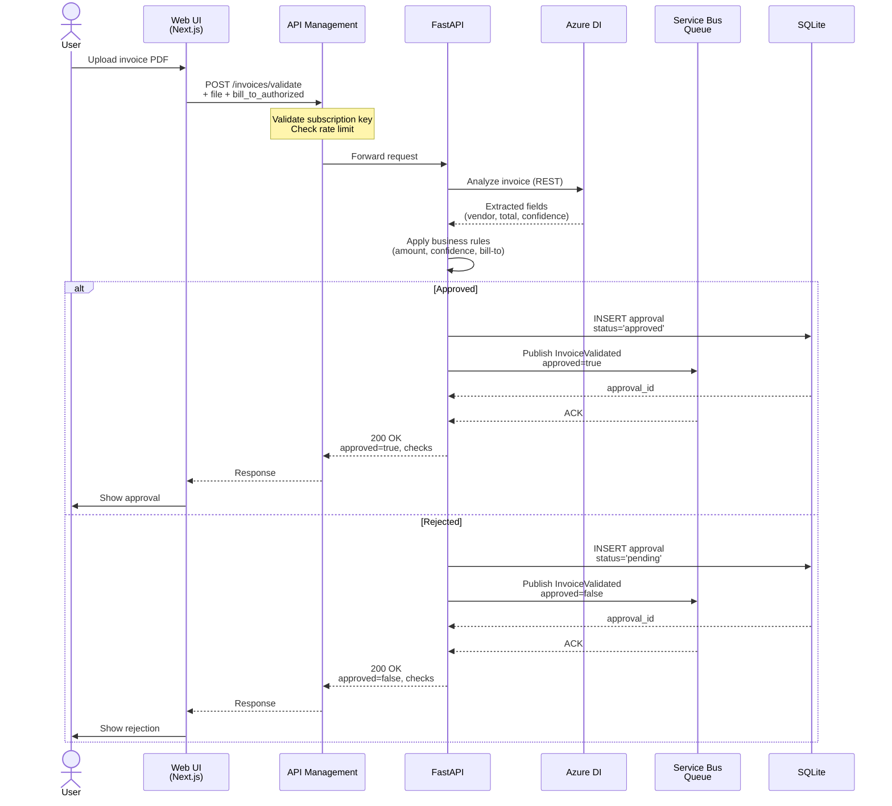
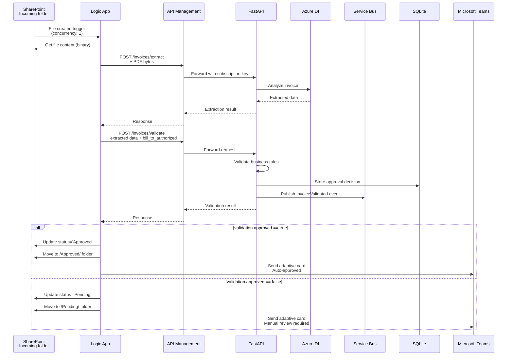
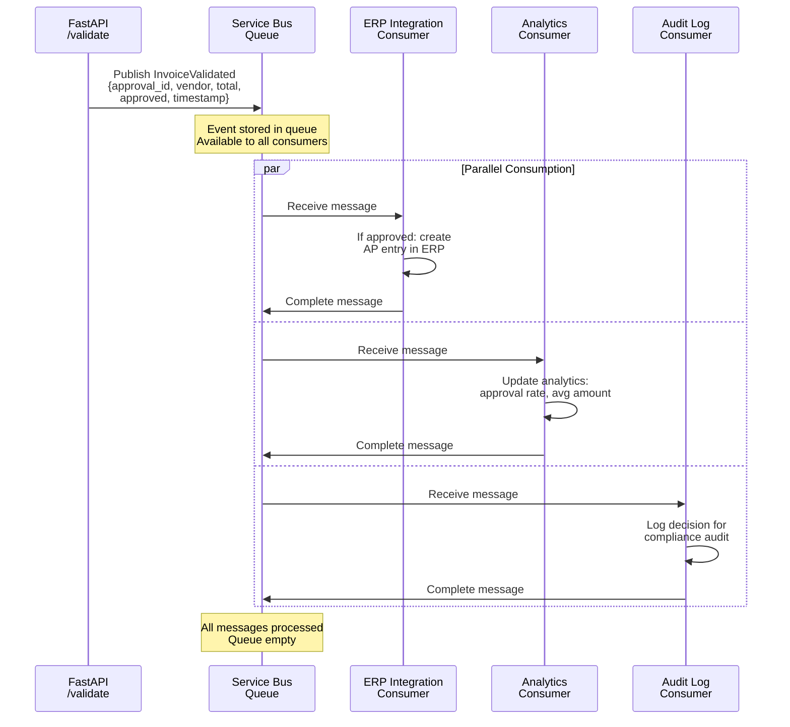
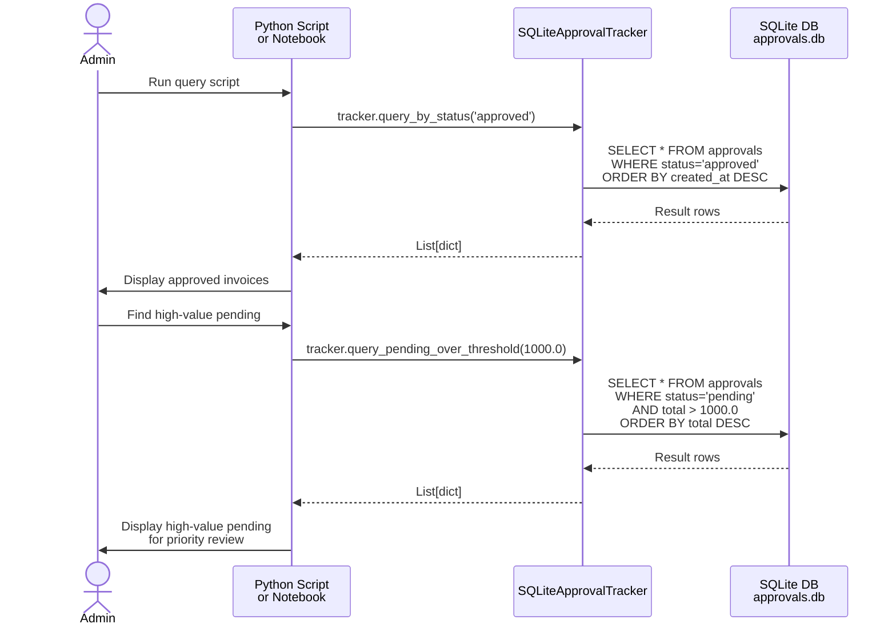

# Integration Design

This document describes the system architecture, integration patterns, and data flows for the Invoice Processing Automation system.

## System Overview

The invoice processing system is a microservices-based solution that combines:
- **FastAPI backend**: RESTful API for invoice extraction and validation
- **Azure Document Intelligence**: AI-powered OCR and field extraction
- **Azure Service Bus**: Event-driven architecture for downstream processing
- **SQLite persistence**: Approval tracking with SQL queries
- **Azure API Management**: Production gateway for security and throttling
- **Microsoft Teams**: Human-in-the-loop approvals via adaptive cards

## Architecture Diagram



## Component Responsibilities

### 1. API Gateway (Azure API Management)
**Purpose**: Centralized security, throttling, and routing
- Validates subscription keys per client
- Enforces rate limits (100 calls/min, 10K/week)
- Handles CORS for browser-based clients
- Routes requests to FastAPI backend
- Provides usage analytics

**Integration Pattern**: Reverse proxy

### 2. FastAPI Backend
**Purpose**: Business logic and orchestration
- `/extract`: Calls Azure DI, returns structured invoice data
- `/validate`: Applies business rules, publishes events, tracks approvals

**Integration Pattern**: REST API with async orchestration

### 3. Azure Document Intelligence
**Purpose**: AI-powered invoice field extraction
- Prebuilt invoice model (Microsoft-validated)
- Returns vendor, total, date, confidence, bill-to
- OCR for full document content

**Integration Pattern**: External REST API (request/response)

### 4. Azure Service Bus (Queue)
**Purpose**: Event-driven architecture for async processing
- Publishes `InvoiceValidated` events after validation
- Decouples validation from downstream processing
- Enables multiple consumers without backend changes

**Integration Pattern**: Publish-subscribe (queue-based)

### 5. SQLite Persistence
**Purpose**: Persistent approval tracking with SQL queries
- Stores approval decisions with timestamps
- Supports queries: `query_by_status()`, `query_pending_over_threshold()`
- Indexed on status and created_at for performance

**Integration Pattern**: Repository pattern with ABC

### 6. Microsoft Teams
**Purpose**: Human-in-the-loop approvals
- Adaptive cards for pending invoices
- Success notifications for auto-approved invoices
- Detailed check results in card body

**Integration Pattern**: Webhook (outbound HTTP POST)

## Sequence Diagrams

### Workflow 1: Invoice Upload via Web UI



### Workflow 2: Logic App Integration (SharePoint Trigger)



### Workflow 3: Event-Driven Downstream Processing



### Workflow 4: Querying Approval History (SQL)



## Data Flow

### Invoice Validation Data Flow

```
┌─────────────┐
│ Invoice PDF │
└──────┬──────┘
       │
       ▼
┌─────────────────────┐
│ Azure Document      │  ← REST API call
│ Intelligence        │  → Returns: vendor, total, date,
└──────┬──────────────┘     invoice_number, confidence,
       │                     bill_to, full_content
       ▼
┌─────────────────────┐
│ Validation Logic    │  Business Rules:
│ (approval_rules.py) │  - Amount ≤ $500?
└──────┬──────────────┘  - Confidence ≥ 85%?
       │                  - Is invoice (not receipt)?
       │                  - Bill-to authorized?
       ▼
       ┌─────────────┐
       │  Decision   │
       └──────┬──────┘
              │
       ┌──────┴──────┐
       ▼             ▼
┌────────────┐  ┌─────────────┐
│ SQLite DB  │  │ Service Bus │
│ (persist)  │  │ (events)    │
└────────────┘  └──────┬──────┘
                       │
                ┌──────┴──────┬──────────┐
                ▼             ▼          ▼
           ┌──────┐    ┌──────────┐  ┌──────┐
           │ ERP  │    │Analytics │  │Audit │
           └──────┘    └──────────┘  └──────┘
```

### Event Structure

**InvoiceValidated Event** (published to Service Bus):

```json
{
  "event_type": "InvoiceValidated",
  "timestamp": "2025-11-03T14:23:45.123Z",
  "approval_id": "550e8400-e29b-41d4-a716-446655440000",
  "vendor": "ACME Corporation",
  "invoice_number": "INV-2025-001",
  "total": 1250.00,
  "approved": false,
  "reason": "Manual review required: amount exceeds $500 threshold",
  "confidence": 0.92
}
```

**Consumers** can filter on:
- `approved`: true/false for routing
- `total`: threshold-based processing
- `confidence`: quality filtering
- `vendor`: vendor-specific workflows

## Integration Patterns

### 1. Repository Pattern (Storage Abstraction)

```python
# Abstract interface
class ApprovalTrackerBase(ABC):
    @abstractmethod
    def create_approval(self, invoice_data: dict) -> str: pass

    @abstractmethod
    def get_approval(self, approval_id: str) -> Optional[dict]: pass

# Multiple implementations
class InMemoryApprovalTracker(ApprovalTrackerBase):  # Fast, testing
class SQLiteApprovalTracker(ApprovalTrackerBase):    # Persistent, SQL queries
class CosmosDBApprovalTracker(ApprovalTrackerBase):  # Cloud-scale (future)
```

**Benefits**:
- Swap implementations without changing business logic
- Easy testing with in-memory tracker
- Migrate to cloud storage when ready

### 2. Event-Driven Architecture (Service Bus)

```python
# Publisher (decoupled from consumers)
publisher.publish_invoice_validated(event)

# Consumers (add new ones without touching API)
- ERP integration: If approved, create AP entry
- Analytics: Track approval rates and trends
- Audit: Log all decisions for compliance
```

**Benefits**:
- Add new consumers without modifying API
- Async processing (non-blocking validation)
- Retry and dead-letter handling built-in
- Multiple subscribers to same event

### 3. API Gateway Pattern (APIM)

```
Client → APIM (policies) → FastAPI Backend
         ↑
         ├─ Subscription key validation
         ├─ Rate limiting (100/min)
         ├─ CORS handling
         ├─ Response caching
         └─ Analytics/logging
```

**Benefits**:
- Security without code changes
- Per-client rate limits
- A/B testing and canary deployments
- Centralized monitoring

## Deployment Architecture

### Local Development
```
Web UI (localhost:3000)
    ↓
FastAPI (localhost:8000)
    ↓
Azure DI (cloud) + SQLite (local) + Service Bus (optional local emulator)
```

### Production (Azure)

```
┌─────────────────────────────────────────────────────┐
│ Azure Subscription                                  │
│                                                     │
│  ┌──────────────────────────────────────────────┐   │
│  │ Resource Group: rg-invoice-automation        │   │
│  │                                              │   │
│  │  ┌────────────────────────────────────────┐  │   │
│  │  │ Azure API Management                   │  │   │
│  │  │ - Developer/Standard SKU               │  │   │
│  │  │ - Public endpoint with custom domain   │  │   │
│  │  └───────────────┬────────────────────────┘  │   │
│  │                  ↓                           │   │
│  │  ┌────────────────────────────────────────┐  │   │
│  │  │ Azure Web App (FastAPI)                │  │   │
│  │  │ - Linux Python 3.11                    │  │   │
│  │  │ - Auto-scaling enabled                 │  │   │
│  │  │ - VNET integration (optional)          │  │   │
│  │  └───────┬──────────────────┬─────────────┘  │   │
│  │          ↓                  ↓                │   │
│  │  ┌──────────────┐  ┌──────────────────────┐  │   │
│  │  │ Azure DI     │  │ Service Bus Namespace│  │   │
│  │  │ (Form Recog) │  │ - Queue: invoice-evt │  │   │
│  │  └──────────────┘  └──────────────────────┘  │   │
│  │                                              │   │
│  │  ┌────────────────────────────────────────┐  │   │
│  │  │ Storage Options                        │  │   │
│  │  │ - SQLite: File in /home (testing)      │  │   │
│  │  │ - Azure SQL: Production scale          │  │   │
│  │  │ - Cosmos DB: Global distribution       │  │   │
│  │  └────────────────────────────────────────┘  │   │
│  └──────────────────────────────────────────────┘   │
│                                                     │
│  ┌──────────────────────────────────────────────┐   │
│  │ Azure Static Web Apps (Next.js UI)           │   │
│  │ - Global CDN                                 │   │
│  │ - Custom domain                              │   │
│  └──────────────────────────────────────────────┘   │
│                                                     │
│  ┌─────────────────────────────────────────────┐    │
│  │ SharePoint Online (Document Library)        │    │
│  │ ┌─────────────────────────────────────────┐ │    │
│  │ │ Logic App (Standard)                    │ │    │
│  │ │ - SharePoint connector                  │ │    │
│  │ │ - HTTP actions to APIM                  │ │    │
│  │ │ - Teams connector                       │ │    │
│  │ └─────────────────────────────────────────┘ │    │
│  └─────────────────────────────────────────────┘    │
│                                                     │
│  ┌──────────────────────────────────────────────┐   │
│  │ Application Insights                         │   │
│  │ - API telemetry                              │   │
│  │ - Distributed tracing                        │   │
│  │ - Custom metrics (approval rate, avg amount) │   │
│  └──────────────────────────────────────────────┘   │
└─────────────────────────────────────────────────────┘
```

## Security Considerations

### Authentication & Authorization
- **APIM**: Subscription keys per client (web UI, Logic Apps)
- **Azure DI**: API key in Key Vault or Web App configuration
- **Service Bus**: Managed Identity or connection string in Key Vault
- **Teams**: Webhook URLs treated as secrets

### Data Protection
- **In-transit**: HTTPS/TLS 1.2+ for all communication
- **At-rest**: Azure Storage encryption, SQLite file permissions
- **PII handling**: Invoice data may contain sensitive vendor/customer info
- **Compliance**: GDPR/CCPA considerations for data retention

### Network Security
- **APIM**: Can restrict FastAPI to only accept traffic from APIM IP
- **VNET integration**: Isolate FastAPI in virtual network
- **Private endpoints**: Azure DI and Service Bus can use private links
- **CORS**: Restrict origins to known domains (no wildcard in production)

## Monitoring & Observability

### Metrics to Track

**API Performance**:
- Request rate (requests/sec)
- Response time (p50, p95, p99)
- Error rate (4xx, 5xx)
- APIM throttling events

**Business Metrics**:
- Approval rate (% auto-approved vs pending)
- Average invoice amount
- Confidence distribution
- Processing time (upload → decision)

**Integration Health**:
- Azure DI latency and errors
- Service Bus queue depth
- Teams notification success rate
- SQLite query performance

### Logging Strategy

```python
# Structured logging with correlation IDs
logger.info("Invoice validated", extra={
    "approval_id": approval_id,
    "vendor": vendor,
    "total": total,
    "approved": approved,
    "duration_ms": duration
})
```

**Log Aggregation**:
- Application Insights for FastAPI logs
- APIM diagnostic logs to Log Analytics
- Service Bus metrics and alerts

## Scalability Considerations

### Current Bottlenecks
1. **Azure DI**: ~1-3 seconds per invoice (external API latency)
2. **SQLite**: Single-writer limitation (fine for moderate load)
3. **Teams webhooks**: Rate limits (~20 req/sec per webhook)

### Scale-Out Strategy

**Horizontal Scaling** (multiple FastAPI instances):
- Web App auto-scale based on CPU/memory
- SQLite → Migrate to Azure SQL for multi-writer support
- In-memory tracker → Replace with distributed cache (Redis)

**Vertical Scaling** (optimize per-instance):
- Async processing with `asyncio` for DI calls
- Connection pooling for Service Bus
- Response caching in APIM for GET endpoints

**Queue-Based Processing** (for high volume):
```
Upload → Queue → Worker Pool → Process
         ↑                      ↓
         └──────────────────────┘
         (Decouple upload from processing)
```

## Error Handling & Resilience

### Retry Strategies

**Azure Document Intelligence**:
- Retry 3x with exponential backoff (2s, 4s, 8s)
- Fallback: Return error, mark invoice for manual processing

**Service Bus**:
- Built-in retry policy (5 attempts)
- Dead-letter queue for permanent failures
- Alert on dead-letter messages

**Teams Notifications**:
- Non-blocking: Log error, don't fail validation
- Retry queue for failed notifications (future enhancement)

### Circuit Breaker Pattern

```python
# If Azure DI has 5 consecutive failures:
# - Open circuit: Return cached/mock data or error
# - Half-open: Try one request after 30 seconds
# - Close circuit: Resume normal operation if successful
```

## Future Enhancements

### Phase 2: Enhanced Storage
- Migrate SQLite → Azure SQL Database
- Add approval history API endpoints
- Implement soft delete for audit retention

### Phase 3: Advanced Event Processing
- Add Service Bus Topics for fan-out scenarios
- Implement event versioning (v1, v2 schemas)
- Add event replay for debugging

### Phase 4: ML-Powered Improvements
- Confidence score calibration based on historical accuracy
- Vendor-specific approval thresholds (trust score)
- Anomaly detection (unusual amounts, duplicate invoices)

### Phase 5: Multi-Tenancy
- Tenant isolation in SQLite (tenant_id column) or per-tenant databases
- APIM subscription keys per tenant
- Tenant-specific approval rules and thresholds

## Appendix: Technology Choices

| Component | Technology | Why Chosen |
|-----------|------------|------------|
| **API Framework** | FastAPI | Modern, async, OpenAPI auto-generation, type safety |
| **OCR/Extraction** | Azure DI | Prebuilt invoice model, high accuracy, Microsoft-validated |
| **Event Bus** | Service Bus Queue | Reliable, dead-letter support, Azure-native integration |
| **Persistence** | SQLite | Simple, serverless, SQL queries, easy migration path |
| **API Gateway** | APIM | Enterprise features (throttling, analytics) without code changes |
| **UI Framework** | Next.js 13+ | React, SSR, app router, TypeScript, excellent DX |
| **Notifications** | Teams Webhooks | Target user base already on Teams, rich adaptive cards |
| **CI/CD** | GitHub Actions | Free for public repos, OIDC with Azure, great ecosystem |

## Conclusion

This integration design demonstrates a production-ready, event-driven architecture that:
- Decouples components for independent scaling
- Uses Azure-native services for reliability
- Supports multiple client types (web, Logic Apps)
- Provides observability and monitoring
- Follows enterprise patterns (repository, gateway, pub/sub)
- Scales from development to production seamlessly
