# ADL M365 Automation Starter


> **Production-Ready AI + Automation across Microsoft 365**
> Enterprise-grade **intelligent invoice processing system** with **FastAPI**, **Azure Document Intelligence**, **Logic Apps**, and **Teams** — featuring comprehensive test coverage, WCAG AA accessible UI, and intelligent document classification.

## Introduction
---

## Quickstart

### Option A: Docker (Recommended)

```bash
# Build and run with Docker
docker build -t adl-m365-api .
docker run --rm -p 8000:8000 \
  -e AZ_DI_ENDPOINT=https://your-di.cognitiveservices.azure.com/ \
  -e AZ_DI_API_KEY=your-key-here \
  -e TEAMS_WEBHOOK_URL=your-webhook-url \
  adl-m365-api
```

**Open:** http://localhost:8000/docs (OpenAPI) • http://localhost:8000/health (Health Check)

### Option B: Docker Compose (Local Dev)

```yaml
# docker-compose.yml
services:
  api:
    build: .
    ports: ["8000:8000"]
    environment:
      - AZ_DI_ENDPOINT=${AZ_DI_ENDPOINT}
      - AZ_DI_API_KEY=${AZ_DI_API_KEY}
      - TEAMS_WEBHOOK_URL=${TEAMS_WEBHOOK_URL}
    env_file: .env
```

```bash
docker compose up --build
```

### Option C: Local Python

```bash
python -m venv .venv && source .venv/bin/activate
pip install -r requirements.txt
uvicorn src.api.main:app --host 0.0.0.0 --port 8000
```

---

## Features at a glance

- **FastAPI service** with OpenAPI docs (`/docs`) and healthcheck (`/health`)
- **Invoice extraction + validation**: amount thresholds, confidence checks, bill-to verification
- **Intelligent document classification**: semantic analysis distinguishes invoices from receipts
- **SQLite persistence**: Approval tracking with SQL queries and indexed searches
- **Event-driven architecture**: Azure Service Bus integration for downstream processing
- **API Management ready**: APIM policy snippets for production gateway
- **Teams notifications**: auto-approve vs. manual-review routing with adaptive cards
- **Containerized**: Docker build + run in one command
- **CI-ready**: 65+ tests (80%+ coverage), automated Docker builds, OIDC deployment

---

## Why this repo
- **Production-ready invoice automation**: Extract → Validate → Route → Approve with intelligent business rules
- **FastAPI-first architecture**: Reusable API endpoints for Logic Apps and web UI
- **Comprehensive testing**: 65+ tests covering extraction, validation, classification, persistence, and event publishing
- **Intelligent document classification**: Payment obligation detection (invoices vs. receipts) using semantic analysis
- **Bill-to verification**: Company whitelist validation for fraud prevention
- **Event-driven architecture**: Azure Service Bus integration for downstream system integration
- **Persistent storage**: SQLite approval tracking with SQL queries and indexes
- **Modern accessible UI**: WCAG AA compliant, colorblind-safe, light/dark theme support
- **Reduce manual review**: *> 80% of invoices auto-approved* when all criteria are met

---

## Architecture

```mermaid
flowchart LR
  A["📄 Invoice Upload<br/>(SharePoint/Web UI)"] --> B["FastAPI<br/>/extract + /validate"]
  B --> C["Azure Document<br/>Intelligence"]
  C --> D{"Pass All Checks?<br/>Amount, Confidence<br/>Type, Bill-To"}
  D -->|"✅ Yes"| E["Auto-Approve<br/>SharePoint: Approved<br/>Teams: Notification"]
  D -->|"⚠️ No"| F["Manual Review<br/>SharePoint: Pending<br/>Teams: Alert"]
```



**Key flow**:
1. Upload invoice via SharePoint or Web UI
2. FastAPI extracts fields and validates against business rules
3. Azure Document Intelligence performs OCR and field extraction
4. Decision engine checks: amount, confidence, document type, bill-to company
5. Auto-approve or route to Teams for manual review
6. Update SharePoint and send notifications

## Quick start

### Run with Docker (Fastest)

Build and run the API locally with Docker:

```bash
# From repo root
docker build -t adl-m365-api .

# Run with environment variables
docker run --rm -p 8000:8000 \
  -e AZ_DI_ENDPOINT=https://your-di.cognitiveservices.azure.com/ \
  -e AZ_DI_KEY=your-key-here \
  -e TEAMS_WEBHOOK_URL=your-webhook-url \
  adl-m365-api

# Open http://localhost:8000/docs for interactive API documentation
# Open http://localhost:8000/health for health check
```

**Multi-platform build** (Apple Silicon + Intel):
```bash
docker buildx build --platform linux/amd64,linux/arm64 -t adl-m365-api .
```

**Docker Compose** (optional, for development):
```yaml
version: '3.8'
services:
  api:
    build: .
    ports:
      - "8000:8000"
    environment:
      - AZ_DI_ENDPOINT=${AZ_DI_ENDPOINT}
      - AZ_DI_KEY=${AZ_DI_KEY}
      - TEAMS_WEBHOOK_URL=${TEAMS_WEBHOOK_URL}
    volumes:
      - ./src:/app/src  # Hot reload for development
```

### Environment Variables

| Variable | Purpose | Required |
|----------|---------|----------|
| `AZ_DI_ENDPOINT` | Azure Document Intelligence endpoint URL | Yes (for real extraction) |
| `AZ_DI_API_KEY` | Azure Document Intelligence API key | Yes (for real extraction) |
| `TEAMS_WEBHOOK_URL` | Microsoft Teams incoming webhook URL | Optional |
| `APPROVAL_AMOUNT_THRESHOLD` | Maximum amount for auto-approval (default: 500.0) | No |
| `APPROVAL_MIN_CONFIDENCE` | Minimum confidence for auto-approval (default: 0.85) | No |
| `APPROVAL_ALLOWED_BILL_TO_NAMES` | Comma-separated list of authorized companies (empty = accept all) | No |

**Tip:** Create a `.env` file in the repo root and use it with Docker Compose or local development. See `.env.example` for all available configuration options.

### Prerequisites (Azure Setup)
- Azure subscription
- SharePoint Online site
- Microsoft Teams channel
- Azure Document Intelligence resource

### Setup Steps

1. **Create SharePoint library structure:**
   ```
   Invoices/
   ├── Incoming/     # Drop new invoices here
   ├── Approved/     # Auto-approved (≤$500, high confidence)
   └── Pending/      # Manual review required
   ```

2. **Create Azure Document Intelligence resource:**
   ```bash
   az cognitiveservices account create \
     --name adl-invoice-extraction \
     --resource-group rg-adl-m365 \
     --kind FormRecognizer \
     --sku S0 \
     --location westus2
   ```

3. **Configure Teams webhook:**
   - Go to Teams channel → Connectors → Incoming Webhook
   - Copy the webhook URL

4. **Deploy Logic App:**
   - Create Logic App in Azure Portal
   - Import `infra/logic-app-definition.json` or build manually using Designer
   - Update connection strings and secrets

5. **Test the workflow:**
   - Upload a sample invoice to SharePoint `/Invoices/Incoming/`
   - Check Teams for notification
   - Verify invoice moved to Approved or Pending folder

See `docs/LOGIC_APPS_SETUP.md` for detailed configuration.

## FastAPI Endpoints

The system exposes two main endpoints for invoice processing:

### `POST /invoices/extract`
Extracts invoice fields using Azure Document Intelligence.
- **Input**: PDF/image file (multipart or raw binary)
- **Output**: Vendor, invoice number, date, total, currency, confidence, bill-to, full OCR content
- **Use case**: Extract structured data from invoice documents

### `POST /invoices/validate`
Validates extracted invoice data against business rules.
- **Input**: Amount, confidence, content, vendor, bill-to, authorized companies list
- **Output**: Approved/rejected decision with detailed check results
- **Validation checks**:
  - Amount within threshold (default: $500)
  - Confidence meets minimum (default: 85%)
  - Document type is invoice (payment obligation detected)
  - Document is not a receipt (payment confirmation rejected)
  - Bill-to company is on authorized list
- **Use case**: Centralized approval logic for Logic Apps and web UI

## Intelligent Document Classification

The system uses **semantic analysis** to distinguish invoices from receipts:

**Invoice indicators** (payment obligation):
- Due dates, payment terms, remittance instructions
- Banking details, ACH information
- "Amount due", "Please remit", "Payment required"

**Receipt indicators** (payment confirmation):
- "Paid", "Payment received", "Thank you for your payment"
- Card transaction details (last 4 digits, authorization code)
- Zero balance, refund information

This mimics how AP clerks determine: *"Does this require payment action?"*

## Bill-To Verification

Validates that invoices are addressed to authorized companies:
- **Configurable whitelist**: Passed via API or UI input
- **Fuzzy matching**: Case-insensitive partial matches
- **Security benefit**: Prevents fraud and misdirected invoice processing
- **User experience**: UI shows rejection reason with company name found

## Logic App Workflow (FastAPI Integration)

**Modern approach** using `infra/logic-app-using-fastapi.json`:

1. **Trigger**: When a file is created in SharePoint `/Invoices/Incoming/` (concurrency: 1)
2. **Get file content** from SharePoint
3. **HTTP POST** to FastAPI `/invoices/extract`: Submit binary PDF
4. **HTTP POST** to FastAPI `/invoices/validate`: Check approval rules
5. **Condition**: Evaluate `validation.approved` from API response
6. **If approved**:
   - Update SharePoint status to "Approved" (metadata only)
   - Move to `/Invoices/Approved/`
   - Send Teams adaptive card with approval details
7. **If pending**:
   - Update SharePoint status to "Pending" (metadata only)
   - Move to `/Invoices/Pending/`
   - Send Teams adaptive card showing failed checks

**Legacy approach** using `infra/logic-app-definition.json`:
- Calls Azure Document Intelligence REST API directly
- Implements approval logic in Logic App expressions
- Kept for reference and comparison

**Key improvements**:
- ✅ Reusable validation logic across Logic Apps and web UI
- ✅ Testable business rules (65+ pytest tests)
- ✅ Detailed check results in Teams notifications
- ✅ Sequential processing with concurrency control
- ✅ Comprehensive adaptive cards with failure details

## Web UI (Next.js)

**Location**: `web/` directory

### Features
- **Drag-and-drop upload**: PDF and image support with hover/focus states
- **Real-time extraction**: Displays extracted invoice fields with confidence levels
- **Validation feedback**: Shows approval decision with detailed check results
- **Company whitelist**: Configurable authorized companies via UI input
- **Theme support**: Light/dark/system preference with localStorage persistence
- **Accessibility**: WCAG AA compliant, keyboard navigation, screen reader support
- **Colorblind-safe design**: Teal/amber/crimson status indicators with icons
- **Responsive layout**: Two-column on desktop, single column on mobile

### Running locally
```bash
cd web
npm install
npm run dev
# Visit http://localhost:3000/upload
```

### Environment configuration
Create `web/.env.local`:
```bash
NEXT_PUBLIC_API_URL=http://127.0.0.1:8000  # or your Azure Web App URL
```

## Azure API Management (Production Gateway)

**Location**: `infra/apim-policies/` directory

Azure API Management (APIM) provides a production-ready gateway layer for the FastAPI backend, adding enterprise features without changing application code.

### Why APIM?

**For this invoice automation system:**
- **Multi-client access control**: Different subscription keys for web UI and Logic Apps
- **Rate limiting per client**: Prevent any single integration from overwhelming the backend
- **CORS management**: Centralized cross-origin policy without touching FastAPI code
- **Usage analytics**: Track which clients use which endpoints and how often
- **Zero-downtime updates**: Route traffic between API versions during deployments
- **Cost attribution**: See usage by department/team via subscription keys

**General benefits:**
- Authentication, throttling, caching, monitoring - all configurable via policies
- No code changes required in FastAPI backend
- Unified gateway for multiple backend services
- Built-in developer portal for API consumers

### Available Policy Snippets

The `infra/apim-policies/` directory contains ready-to-use policy examples:

1. **`subscription-key-policy.xml`**: Authentication via subscription keys
   - Validates `Ocp-Apim-Subscription-Key` header
   - Rejects unauthorized requests with 401
   - Adds subscription info to backend headers

2. **`rate-limit-policy.xml`**: Protect backend from overload
   - 100 calls/minute per subscription
   - 10,000 calls/week quota
   - Configurable by product tier (free, standard, premium)

3. **`cors-policy.xml`**: Cross-origin request handling
   - Allows localhost:3000 for local development
   - Placeholder comments for production domains
   - Supports credentials and common HTTP methods

4. **`complete-policy-example.xml`**: Combined production policy
   - CORS + authentication + rate limiting
   - Response caching for GET requests
   - Security headers (X-Content-Type-Options, X-Frame-Options)
   - User-friendly error messages

### Quick Setup

**1. Create APIM instance** (one-time setup):
```bash
# Create APIM instance (takes ~30-45 minutes)
az apim create \
  --name adl-invoice-apim \
  --resource-group rg-adl-m365 \
  --publisher-email admin@yourcompany.com \
  --publisher-name "Your Company" \
  --sku-name Developer  # or Basic, Standard, Premium for production

# Note the gateway URL: https://adl-invoice-apim.azure-api.net
```

**2. Import FastAPI as an API**:
```bash
# Option A: Import from OpenAPI spec (recommended)
az apim api import \
  --resource-group rg-adl-m365 \
  --service-name adl-invoice-apim \
  --path invoices \
  --specification-url https://your-api.azurewebsites.net/openapi.json \
  --specification-format OpenApi \
  --api-id invoice-api

# Option B: Manually configure in Azure Portal
# Go to APIM → APIs → Add API → HTTP → Configure endpoints
```

**3. Apply policies**:
```bash
# Apply at API level (all operations)
az apim api policy create \
  --resource-group rg-adl-m365 \
  --service-name adl-invoice-apim \
  --api-id invoice-api \
  --xml-value @infra/apim-policies/complete-policy-example.xml

# Or apply in Azure Portal: APIM → APIs → Invoice API → All operations → Policies
```

**4. Create products and subscriptions**:
```bash
# Create product (e.g., "Invoice Processing - Standard")
az apim product create \
  --resource-group rg-adl-m365 \
  --service-name adl-invoice-apim \
  --product-id invoice-standard \
  --product-name "Invoice Processing - Standard" \
  --description "Standard tier with 10K calls/week" \
  --subscription-required true \
  --approval-required false \
  --state published

# Add API to product
az apim product api add \
  --resource-group rg-adl-m365 \
  --service-name adl-invoice-apim \
  --product-id invoice-standard \
  --api-id invoice-api

# Create subscription (generates key automatically)
az apim subscription create \
  --resource-group rg-adl-m365 \
  --service-name adl-invoice-apim \
  --scope /products/invoice-standard \
  --name web-ui-subscription
```

**5. Update clients to use APIM**:
```bash
# Web UI: Update .env.local
NEXT_PUBLIC_API_URL=https://adl-invoice-apim.azure-api.net/invoices
NEXT_PUBLIC_APIM_SUBSCRIPTION_KEY=your-subscription-key-here

# Logic Apps: Update HTTP action
# URL: https://adl-invoice-apim.azure-api.net/invoices/extract
# Headers: {"Ocp-Apim-Subscription-Key": "your-key"}
```

### Policy Customization

**Adjust rate limits** based on expected load:
```xml
<!-- High-volume tier: 1000 calls/minute -->
<rate-limit calls="1000" renewal-period="60" />
<quota calls="100000" renewal-period="604800" />
```

**Add IP whitelisting** for extra security:
```xml
<ip-filter action="allow">
    <address>203.0.113.0/24</address>  <!-- Your corporate network -->
    <address>198.51.100.50</address>   <!-- Specific server IP -->
</ip-filter>
```

**Enable response caching** for read-heavy endpoints:
```xml
<cache-lookup vary-by-developer="false" downstream-caching-type="none" />
<!-- In <outbound> section: -->
<cache-store duration="300" />  <!-- Cache for 5 minutes -->
```

### Integration with FastAPI

APIM sits in front of FastAPI, forwarding validated requests:

```
Client → APIM (validate subscription, apply policies) → FastAPI → Azure DI
       ↑                                                  ↓
   Policy checks:                               Business logic:
   - Subscription key                           - Extract invoice
   - Rate limit                                 - Validate rules
   - CORS                                       - Publish events
```

**Key points:**
- FastAPI endpoints remain unchanged (no code modifications needed)
- APIM URL becomes the public-facing endpoint
- Direct FastAPI URL can be restricted to APIM's IP only (network security)
- All policy enforcement happens at the gateway layer

### Monitoring & Analytics

**View usage in Azure Portal:**
- APIM → Analytics → See requests by operation, response time, geography
- APIM → Subscriptions → See usage per client/team
- Application Insights integration for detailed telemetry

**Common queries:**
- Which clients hit rate limits?
- What's the p95 latency for `/validate`?
- How many requests failed authentication?

## Testing (65+ tests, 80%+ coverage)

**Test suite**: `tests/` directory

### Coverage areas
1. **Bill-to whitelist verification** (`test_bill_to_whitelist.py`): 12 tests
   - Company name validation and fuzzy matching
   - Case-insensitive and partial matching
   - Whitelist enforcement and edge cases

2. **SQLite persistence** (`test_sqlite_approvals.py`): 11 tests
   - Approval tracking with SQL queries
   - Status-based filtering and threshold queries
   - Persistence across instances

3. **Real invoice integration** (`test_integration_real_invoices.py`): 9 tests
   - End-to-end testing with actual invoice samples
   - Azure DI integration validation
   - Complete approval workflow testing

4. **Service Bus events** (`test_service_bus_events.py`): 8 tests
   - Event structure and serialization
   - Publishing to Azure Service Bus
   - Event metadata and routing

5. **Invoice validation** (`test_validate.py`): 8 tests
   - Amount thresholds and confidence checks
   - Document classification (invoice vs receipt)
   - Business rule validation

6. **Approval workflow** (`test_approval_workflow.py`): 7 tests
   - Approval/rejection flow
   - Status transitions and tracking
   - Multi-step approval processes

7. **Invoice extraction** (`test_extract.py`): 5 tests
   - Azure DI integration and field parsing
   - Confidence scoring and data extraction

8. **Service Bus integration** (`test_service_bus_integration.py`): 3 tests (requires --run-integration)
   - Real Azure Service Bus Queue integration
   - Event publishing and consumption
   - Message cleanup and verification

9. **Approval actions** (`test_approve.py`): 2 tests
    - Approval decision tracking
    - Action validation

10. **Health checks** (`test_health.py`): 1 test
    - API health endpoint validation

### Running tests
```bash
# Install dependencies
pip install -r requirements.txt

# Run all tests with coverage
pytest --cov=src --cov-report=html --cov-report=term

# Run specific test file
pytest tests/test_validate.py -v

# Run with live Azure DI (set AZ_DI_ENDPOINT and AZ_DI_KEY)
pytest tests/test_integration_real_invoices.py --run-live
```

## CI/CD with GitHub Actions

**Pipeline file**: `.github/workflows/ci-deploy.yml`

### Workflow
1. **Trigger**: Push to `main` branch or manual workflow dispatch
2. **Install dependencies**: Python 3.11 + pip install from requirements.txt
3. **Run tests**: pytest with coverage reporting (78%+ required)
4. **Azure login**: OIDC authentication (no secrets!)
5. **Deploy**: Azure Web App deployment with startup command

### Setup (OIDC - No secrets needed!)
Configure federated credentials in Azure:
```bash
# Create app registration
az ad app create --display-name "GitHub-ADL-M365"

# Create service principal
az ad sp create --id <APP_ID>

# Assign contributor role
az role assignment create --role Contributor \
  --subscription <SUBSCRIPTION_ID> \
  --assignee-object-id <SP_OBJECT_ID> \
  --assignee-principal-type ServicePrincipal \
  --scope /subscriptions/<SUBSCRIPTION_ID>/resourceGroups/rg-adl-m365

# Add federated credential for main branch
az ad app federated-credential create \
  --id <APP_ID> \
  --parameters '{
    "name": "GitHubMain",
    "issuer": "https://token.actions.githubusercontent.com",
    "subject": "repo:YOUR_ORG/adl-m365-automation-starter:ref:refs/heads/main",
    "audiences": ["api://AzureADTokenExchange"]
  }'
```

### GitHub Secrets
Add these repository secrets (Settings → Secrets and variables → Actions):
- `AZURE_CLIENT_ID`: Application (client) ID
- `AZURE_TENANT_ID`: Directory (tenant) ID
- `AZURE_SUBSCRIPTION_ID`: Subscription ID

**Benefits of OIDC**:
- ✅ No rotating secrets or passwords
- ✅ Short-lived tokens only
- ✅ Azure AD manages authentication

## Responsible AI & Security
- **Validated AI models**: Azure Document Intelligence prebuilt invoice model (Microsoft-validated)
- **Confidence thresholds**: 85% minimum prevents low-quality extractions from auto-approval
- **Intelligent classification**: Semantic analysis distinguishes invoices from receipts
- **Bill-to verification**: Company whitelist prevents fraud and misdirected invoices
- **Human-in-the-loop**: Low confidence invoices require manual Teams approval
- **Secrets management**: Azure Key Vault (recommended) or Logic App parameters
- **Data residency**: All processing within Azure tenant (data never leaves Microsoft cloud)
- **Audit trail**: Approval tracker maintains decision history with timestamps
- **WCAG AA compliance**: Accessible UI for all users including colorblind and screen reader users

## Citizen-Developer Integration
- **Logic Apps**: Enterprise-grade with SharePoint connectors and governance
- **Excel/Power BI**: Query `/approvals/approved` endpoint for reporting and analytics
- **Teams**: Rich adaptive cards with approval/rejection actions

## Repo layout
```
src/                          # FastAPI application
├── api/                      # API endpoints and routing
│   ├── main.py              # FastAPI app initialization with CORS
│   ├── deps.py              # Shared dependencies and models
│   └── routers/             # API route handlers
│       ├── invoice.py       # Invoice endpoints: extract, validate
│       └── health.py        # Health check endpoint
├── services/                # Business logic layer
│   ├── form_recognizer.py  # Azure DI integration
│   ├── approval_rules.py   # Validation business rules + document classification
│   ├── invoice_types.py    # Type definitions for invoice processing
│   ├── storage/             # Data persistence
│   │   ├── approval_tracker_base.py  # Repository pattern ABC
│   │   ├── approvals.py             # Approval tracker (in-memory)
│   │   └── approvals_sqlite.py      # SQLite persistent storage
│   ├── events/              # Event publishing
│   │   └── event_publisher.py       # Azure Service Bus integration
│   └── graph.py            # Teams integration
├── models/                  # Pydantic data models
│   └── invoice.py          # Invoice and approval request models
└── core/                    # Core utilities
    ├── config.py           # Configuration management
    └── logging.py          # Logging setup

web/                         # Next.js web UI
├── app/                     # Next.js 13+ app directory
│   ├── globals.css         # Design system (17KB)
│   ├── layout.tsx          # Root layout with theme provider
│   ├── page.tsx            # Home page
│   └── upload/             # Upload page
│       └── page.tsx        # Invoice upload interface
└── components/              # React components
    ├── ThemeProvider.tsx   # Theme context and localStorage
    ├── ThemeToggle.tsx     # Light/dark theme toggle
    ├── DragDropArea.tsx    # File upload component
    └── ExtractedDataDisplay.tsx  # Results display

tests/                       # Pytest test suite (65+ tests)
├── conftest.py                      # Pytest configuration (integration test markers)
├── test_bill_to_whitelist.py        # 12 tests: Bill-to verification
├── test_sqlite_approvals.py         # 11 tests: SQLite persistence
├── test_integration_real_invoices.py # 9 tests: End-to-end integration
├── test_service_bus_events.py       # 8 tests: Service Bus unit tests
├── test_validate.py                 # 8 tests: Validation rules
├── test_approval_workflow.py        # 7 tests: Approval flow
├── test_extract.py                  # 5 tests: Invoice extraction
├── test_service_bus_integration.py  # 3 tests: Real Service Bus (--run-integration)
├── test_approve.py                  # 2 tests: Approval actions
└── test_health.py                   # 1 test: Health endpoint

docs/                        # Setup guides and architecture
├── INTEGRATION_DESIGN.md   # System architecture with sequence diagrams
├── LOGIC_APPS_SETUP.md     # Logic Apps configuration
└── SHAREPOINT_SETUP.md     # SharePoint library setup

infra/                       # Infrastructure definitions
├── apim-policies/           # Azure API Management policy snippets
│   ├── subscription-key-policy.xml    # Authentication via subscription keys
│   ├── rate-limit-policy.xml          # Rate limiting and quotas
│   ├── cors-policy.xml                # Cross-origin request handling
│   └── complete-policy-example.xml    # Combined production policy
├── postman_collection.json  # API testing collection with automated tests
├── bicep/                   # Azure Bicep templates
├── logic-app-using-fastapi.json  # Modern Logic App (FastAPI integration)
└── logic-app-definition.json     # Legacy Logic App (direct Azure DI calls)

.github/workflows/           # GitHub Actions CI/CD
└── ci-deploy.yml           # Test + deploy with OIDC

samples/                     # Sample invoices for testing
```

## Demo script (5 minutes)

### Scenario A: Web UI (fastest for demos)
1. Open `http://localhost:3000/upload` (or deployed URL)
2. Configure authorized companies: "My Company Pty Ltd, Acme Corporation"
3. Drag and drop sample invoice PDF
4. Watch real-time extraction: vendor, total, confidence, bill-to
5. View validation results with colorblind-safe indicators
6. See detailed check results: ✓ or ✗ for each rule
7. Toggle light/dark theme to show accessibility features

### Scenario B: SharePoint + Logic App (production workflow)
1. Upload sample invoice to SharePoint `/Invoices/Incoming/`
2. Logic App triggers within 1 minute (concurrency: 1)
3. FastAPI extracts fields via Azure Document Intelligence
4. Validation checks: amount, confidence, document type, bill-to
5. Auto-routed to `/Invoices/Approved/` or `/Invoices/Pending/`
6. SharePoint metadata updated (Status column)
7. Teams adaptive card sent with approval details or failure reasons


## What's New (Recent Additions)

### 2025-11 (Azure Integration Enhancements)
- ✅ **SQLite persistence**: Repository pattern with SQL queries for approval tracking
- ✅ **Event-driven architecture**: Azure Service Bus integration for downstream processing
- ✅ **APIM ready**: Complete API Management policy snippets and documentation
- ✅ **Integration design docs**: Comprehensive architecture documentation with sequence diagrams
- ✅ **Postman collection**: Automated API tests with verified response formats
- ✅ **19+ new tests**: SQLite persistence, Service Bus events, real Azure integration tests

### 2025-01 (FastAPI + Testing)
- ✅ **FastAPI architecture**: Reusable API endpoints for all integrations
- ✅ **Comprehensive testing**: TDD approach with 65+ tests, 80%+ coverage
- ✅ **Intelligent classification**: Semantic analysis of payment obligation vs confirmation
- ✅ **Bill-to verification**: Company whitelist validation for fraud prevention
- ✅ **Modern Logic App**: FastAPI integration with adaptive cards

### 2025-01 (UI Redesign)
- ✅ **WCAG AA accessibility**: Keyboard navigation, screen readers, focus indicators
- ✅ **Colorblind-safe design**: Teal/amber/crimson with icons (not red/green)
- ✅ **Theme system**: Light/dark/system with localStorage persistence
- ✅ **Responsive layout**: Two-column desktop, single-column mobile
- ✅ **Design tokens**: 849-line CSS design system with semantic naming

## License
MIT (see `LICENSE`).
