# ADL M365 Automation Starter


> **Production-Ready AI + Automation across Microsoft 365**
> Enterprise-grade **intelligent invoice processing system** with **FastAPI**, **Azure Document Intelligence**, **Logic Apps**, and **Teams** — featuring comprehensive test coverage, WCAG AA accessible UI, and intelligent document classification.

 **[Watch the 2.5 minute demo →](https://youtu.be/a_5d8T2u-dQ)**

---

## Why this repo
- **Production-ready invoice automation**: Extract → Validate → Route → Approve with intelligent business rules
- **FastAPI-first architecture**: Reusable API endpoints for Logic Apps, Power Automate, and web UI
- **Comprehensive testing**: 73+ tests covering extraction, validation, classification, and approval workflows
- **Intelligent document classification**: Payment obligation detection (invoices vs. receipts) using semantic analysis
- **Bill-to verification**: Company whitelist validation for fraud prevention
- **Modern accessible UI**: WCAG AA compliant, colorblind-safe, light/dark theme support
- **Reduce manual review**: *> 80% of invoices auto-approved* when all criteria are met

---

## Architecture

```mermaid
flowchart LR
  A["📄 Invoice Upload<br/>(SharePoint/Web/Power Automate)"] --> B["FastAPI<br/>/extract + /validate"]
  B --> C["Azure Document<br/>Intelligence"]
  C --> D{"Pass All Checks?<br/>Amount, Confidence<br/>Type, Bill-To"}
  D -->|"✅ Yes"| E["Auto-Approve<br/>SharePoint: Approved<br/>Teams: Notification"]
  D -->|"⚠️ No"| F["Manual Review<br/>SharePoint: Pending<br/>Teams: Alert"]
```



**Key flow**:
1. Upload invoice via SharePoint, Web UI, or Power Automate
2. FastAPI extracts fields and validates against business rules
3. Azure Document Intelligence performs OCR and field extraction
4. Decision engine checks: amount, confidence, document type, bill-to company
5. Auto-approve or route to Teams for manual review
6. Update SharePoint and send notifications

## Quick start

### Prerequisites
- Azure subscription
- SharePoint Online site
- Microsoft Teams channel
- Azure Document Intelligence resource

### Setup Steps

1. **Create SharePoint library structure:**
   ```
   Invoices/
   ├── Incoming/     # Drop new invoices here
   ├── Approved/     # Auto-approved (≤$500, high confidence)
   └── Pending/      # Manual review required
   ```

2. **Create Azure Document Intelligence resource:**
   ```bash
   az cognitiveservices account create \
     --name adl-invoice-extraction \
     --resource-group rg-adl-m365 \
     --kind FormRecognizer \
     --sku S0 \
     --location westus2
   ```

3. **Configure Teams webhook:**
   - Go to Teams channel → Connectors → Incoming Webhook
   - Copy the webhook URL

4. **Deploy Logic App:**
   - Create Logic App in Azure Portal
   - Import `infra/logic-app-definition.json` or build manually using Designer
   - Update connection strings and secrets

5. **Test the workflow:**
   - Upload a sample invoice to SharePoint `/Invoices/Incoming/`
   - Check Teams for notification
   - Verify invoice moved to Approved or Pending folder

See `docs/LOGIC_APPS_SETUP.md` for detailed configuration.

## FastAPI Endpoints

The system exposes three main endpoints for invoice processing:

### `POST /invoices/extract`
Extracts invoice fields using Azure Document Intelligence.
- **Input**: PDF/image file (multipart or raw binary)
- **Output**: Vendor, invoice number, date, total, currency, confidence, bill-to, full OCR content
- **Use case**: Extract structured data from invoice documents

### `POST /invoices/validate`
Validates extracted invoice data against business rules.
- **Input**: Amount, confidence, content, vendor, bill-to, authorized companies list
- **Output**: Approved/rejected decision with detailed check results
- **Validation checks**:
  - Amount within threshold (default: $500)
  - Confidence meets minimum (default: 85%)
  - Document type is invoice (payment obligation detected)
  - Document is not a receipt (payment confirmation rejected)
  - Bill-to company is on authorized list
- **Use case**: Centralized approval logic for Logic Apps, Power Automate, web UI

### `POST /invoices/process`
End-to-end processing with automatic routing.
- **Input**: PDF/image file, confidence threshold
- **Output**: Auto-approved or pending-approval with approval ID
- **Behavior**: High confidence → auto-approve, low confidence → send to Teams for review
- **Use case**: Single-call invoice processing

## Intelligent Document Classification

The system uses **semantic analysis** to distinguish invoices from receipts:

**Invoice indicators** (payment obligation):
- Due dates, payment terms, remittance instructions
- Banking details, ACH information
- "Amount due", "Please remit", "Payment required"

**Receipt indicators** (payment confirmation):
- "Paid", "Payment received", "Thank you for your payment"
- Card transaction details (last 4 digits, authorization code)
- Zero balance, refund information

This mimics how AP clerks determine: *"Does this require payment action?"*

## Bill-To Verification

Validates that invoices are addressed to authorized companies:
- **Configurable whitelist**: Passed via API or UI input
- **Fuzzy matching**: Case-insensitive partial matches
- **Security benefit**: Prevents fraud and misdirected invoice processing
- **User experience**: UI shows rejection reason with company name found

## Logic App Workflow (FastAPI Integration)

**Modern approach** using `infra/logic-app-using-fastapi.json`:

1. **Trigger**: When a file is created in SharePoint `/Invoices/Incoming/` (concurrency: 1)
2. **Get file content** from SharePoint
3. **HTTP POST** to FastAPI `/invoices/extract`: Submit binary PDF
4. **HTTP POST** to FastAPI `/invoices/validate`: Check approval rules
5. **Condition**: Evaluate `validation.approved` from API response
6. **If approved**:
   - Update SharePoint status to "Approved" (metadata only)
   - Move to `/Invoices/Approved/`
   - Send Teams adaptive card with approval details
7. **If pending**:
   - Update SharePoint status to "Pending" (metadata only)
   - Move to `/Invoices/Pending/`
   - Send Teams adaptive card showing failed checks

**Legacy approach** using `infra/logic-app-definition.json`:
- Calls Azure Document Intelligence REST API directly
- Implements approval logic in Logic App expressions
- Kept for reference and comparison

**Key improvements**:
- ✅ Reusable validation logic across Logic Apps, Power Automate, web UI
- ✅ Testable business rules (73+ pytest tests)
- ✅ Detailed check results in Teams notifications
- ✅ Sequential processing with concurrency control
- ✅ Comprehensive adaptive cards with failure details

## Web UI (Next.js)

**Location**: `web/` directory

### Features
- **Drag-and-drop upload**: PDF and image support with hover/focus states
- **Real-time extraction**: Displays extracted invoice fields with confidence levels
- **Validation feedback**: Shows approval decision with detailed check results
- **Company whitelist**: Configurable authorized companies via UI input
- **Theme support**: Light/dark/system preference with localStorage persistence
- **Accessibility**: WCAG AA compliant, keyboard navigation, screen reader support
- **Colorblind-safe design**: Teal/amber/crimson status indicators with icons
- **Responsive layout**: Two-column on desktop, single column on mobile

### Running locally
```bash
cd web
npm install
npm run dev
# Visit http://localhost:3000/upload
```

### Environment configuration
Create `web/.env.local`:
```bash
NEXT_PUBLIC_API_URL=http://127.0.0.1:8000  # or your Azure Web App URL
```

## Testing (73+ tests, 80%+ coverage)

**Test suite**: `tests/` directory

### Coverage areas
1. **Invoice extraction** (`test_invoice_extraction.py`): 23 tests
   - Azure DI integration, field parsing, confidence scoring
   - Multipage documents, missing fields, malformed responses
   - Bill-to extraction and validation

2. **Validation rules** (`test_validation_rules.py`): 17 tests
   - Amount thresholds, confidence requirements
   - Document classification (invoice vs receipt)
   - Bill-to authorization checks
   - Edge cases and boundary conditions

3. **Document classification** (`test_document_classification.py`): 12 tests
   - Payment obligation detection (invoices)
   - Payment confirmation detection (receipts)
   - Semantic analysis of keywords and context

4. **API endpoints** (`test_api_endpoints.py`): 21 tests
   - `/extract`, `/validate`, `/process` endpoints
   - Request validation, error handling
   - Binary and multipart file uploads
   - Approval tracking and listing

### Running tests
```bash
# Install dependencies
pip install -r requirements.txt

# Run all tests with coverage
pytest --cov=src --cov-report=html --cov-report=term

# Run specific test file
pytest tests/test_validation_rules.py -v

# Run with live Azure DI (set AZ_DI_ENDPOINT and AZ_DI_KEY)
pytest tests/test_invoice_extraction.py --run-live
```

## CI/CD with GitHub Actions

**Pipeline file**: `.github/workflows/ci-deploy.yml`

### Workflow
1. **Trigger**: Push to `main` branch or manual workflow dispatch
2. **Install dependencies**: Python 3.11 + pip install from requirements.txt
3. **Run tests**: pytest with coverage reporting (78%+ required)
4. **Azure login**: OIDC authentication (no secrets!)
5. **Deploy**: Azure Web App deployment with startup command

### Setup (OIDC - No secrets needed!)
Configure federated credentials in Azure:
```bash
# Create app registration
az ad app create --display-name "GitHub-ADL-M365"

# Create service principal
az ad sp create --id <APP_ID>

# Assign contributor role
az role assignment create --role Contributor \
  --subscription <SUBSCRIPTION_ID> \
  --assignee-object-id <SP_OBJECT_ID> \
  --assignee-principal-type ServicePrincipal \
  --scope /subscriptions/<SUBSCRIPTION_ID>/resourceGroups/rg-adl-m365

# Add federated credential for main branch
az ad app federated-credential create \
  --id <APP_ID> \
  --parameters '{
    "name": "GitHubMain",
    "issuer": "https://token.actions.githubusercontent.com",
    "subject": "repo:YOUR_ORG/adl-m365-automation-starter:ref:refs/heads/main",
    "audiences": ["api://AzureADTokenExchange"]
  }'
```

### GitHub Secrets
Add these repository secrets (Settings → Secrets and variables → Actions):
- `AZURE_CLIENT_ID`: Application (client) ID
- `AZURE_TENANT_ID`: Directory (tenant) ID
- `AZURE_SUBSCRIPTION_ID`: Subscription ID

**Benefits of OIDC**:
- ✅ No rotating secrets or passwords
- ✅ Short-lived tokens only
- ✅ Azure AD manages authentication

## Responsible AI & Security
- **Validated AI models**: Azure Document Intelligence prebuilt invoice model (Microsoft-validated)
- **Confidence thresholds**: 85% minimum prevents low-quality extractions from auto-approval
- **Intelligent classification**: Semantic analysis distinguishes invoices from receipts
- **Bill-to verification**: Company whitelist prevents fraud and misdirected invoices
- **Human-in-the-loop**: Low confidence invoices require manual Teams approval
- **Secrets management**: Azure Key Vault (recommended) or Logic App parameters
- **Data residency**: All processing within Azure tenant (data never leaves Microsoft cloud)
- **Audit trail**: Approval tracker maintains decision history with timestamps
- **WCAG AA compliance**: Accessible UI for all users including colorblind and screen reader users

## Citizen-Developer Integration
- **Power Automate**: Call FastAPI `/extract` and `/validate` endpoints, route to Teams based on response
- **Logic Apps**: Enterprise-grade with SharePoint connectors and governance
- **Excel/Power BI**: Query `/approvals/approved` endpoint for reporting and analytics
- **Teams**: Rich adaptive cards with approval/rejection actions

## Repo layout
```
src/                          # FastAPI application
├── api/                      # API endpoints and routing
│   ├── main.py              # FastAPI app initialization
│   ├── deps.py              # Shared dependencies and models
│   └── routers/             # API route handlers
│       └── invoice.py       # Invoice endpoints: extract, validate, process
├── services/                # Business logic layer
│   ├── form_recognizer.py  # Azure DI integration
│   ├── approval_rules.py   # Validation business rules
│   ├── document_classifier.py  # Invoice vs receipt detection
│   ├── storage.py          # Approval tracker (in-memory)
│   └── graph.py            # Teams integration
└── models/                  # Pydantic data models
    └── invoice.py          # Invoice and approval request models

web/                         # Next.js web UI
├── app/                     # Next.js 13+ app directory
│   ├── globals.css         # Design system (849 lines)
│   ├── layout.tsx          # Root layout with theme provider
│   └── upload/             # Upload page
└── components/              # React components
    ├── ThemeProvider.tsx   # Theme context and localStorage
    ├── ThemeToggle.tsx     # Light/dark theme toggle
    ├── DragDropArea.tsx    # File upload component
    └── ExtractedDataDisplay.tsx  # Results display

tests/                       # Pytest test suite (73+ tests)
├── test_invoice_extraction.py      # 23 tests: Azure DI integration
├── test_validation_rules.py        # 17 tests: Business rules
├── test_document_classification.py # 12 tests: Invoice vs receipt
└── test_api_endpoints.py           # 21 tests: API integration

docs/                        # Setup guides
├── LOGIC_APPS_SETUP.md     # Logic Apps configuration
├── SHAREPOINT_SETUP.md     # SharePoint library setup
├── POWER_AUTOMATE_INTEGRATION.md  # Power Automate workflows
└── POWERSHELL_EXAMPLES.md  # PowerShell scripting examples

infra/                       # Infrastructure definitions
├── bicep/                   # Azure Bicep templates
├── logic-app-using-fastapi.json  # Modern Logic App (FastAPI integration)
└── logic-app-definition.json     # Legacy Logic App (direct Azure DI calls)

.github/workflows/           # GitHub Actions CI/CD
└── ci-deploy.yml           # Test + deploy with OIDC

samples/                     # Sample invoices for testing
```

## Demo script (5 minutes)

### Scenario A: Web UI (fastest for demos)
1. Open `http://localhost:3000/upload` (or deployed URL)
2. Configure authorized companies: "My Company Pty Ltd, Acme Corporation"
3. Drag and drop sample invoice PDF
4. Watch real-time extraction: vendor, total, confidence, bill-to
5. View validation results with colorblind-safe indicators
6. See detailed check results: ✓ or ✗ for each rule
7. Toggle light/dark theme to show accessibility features

### Scenario B: SharePoint + Logic App (production workflow)
1. Upload sample invoice to SharePoint `/Invoices/Incoming/`
2. Logic App triggers within 1 minute (concurrency: 1)
3. FastAPI extracts fields via Azure Document Intelligence
4. Validation checks: amount, confidence, document type, bill-to
5. Auto-routed to `/Invoices/Approved/` or `/Invoices/Pending/`
6. SharePoint metadata updated (Status column)
7. Teams adaptive card sent with approval details or failure reasons

### Scenario C: Power Automate (citizen developer)
1. Configure flow: SharePoint trigger → HTTP POST to FastAPI
2. Call `/invoices/extract` with file content
3. Call `/invoices/validate` with extracted data + company whitelist
4. Branch on `approved` field from response
5. Send customized Teams message or email
6. Update Excel/Dataverse with approval decision

## What's New (Recent Additions)

### 2025-01 (FastAPI + Testing)
- ✅ **FastAPI architecture**: Reusable API endpoints for all integrations
- ✅ **73+ comprehensive tests**: 80%+ coverage across extraction, validation, classification
- ✅ **Intelligent classification**: Semantic analysis of payment obligation vs confirmation
- ✅ **Bill-to verification**: Company whitelist validation for fraud prevention
- ✅ **Modern Logic App**: FastAPI integration with adaptive cards

### 2025-01 (UI Redesign)
- ✅ **WCAG AA accessibility**: Keyboard navigation, screen readers, focus indicators
- ✅ **Colorblind-safe design**: Teal/amber/crimson with icons (not red/green)
- ✅ **Theme system**: Light/dark/system with localStorage persistence
- ✅ **Responsive layout**: Two-column desktop, single-column mobile
- ✅ **Design tokens**: 849-line CSS design system with semantic naming

## License
MIT (see `LICENSE`).
