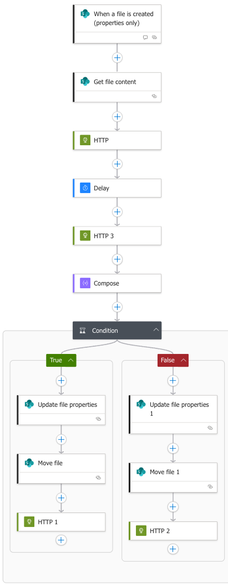

# Logic Apps Setup Guide

This guide explains how to set up the intelligent invoice processing workflow using Azure Logic Apps with FastAPI integration, Azure Document Intelligence, SharePoint Online, and Microsoft Teams.

## Overview

There are two approaches available for implementing the Logic App workflow:

1. **✅ Recommended: FastAPI Integration** (`logic-app-using-fastapi.json`)
   - Calls centralized FastAPI endpoints for extraction and validation
   - Reusable business logic across Logic Apps, web UI, and API clients
   - Testable validation rules (65+ pytest tests)
   - Intelligent document classification (invoice vs receipt detection)
   - Bill-to company verification
   - Easier to maintain and modify

2. **Alternative: Legacy Direct Integration** (`logic-app-definition.json`)
   - Direct Azure Document Intelligence API calls
   - Business logic embedded in Logic App expressions
   - Kept for reference and backward compatibility

**This guide primarily covers the recommended FastAPI integration approach.**

---

## Architecture Overview



### Modern FastAPI Workflow

The workflow automatically:
1. Monitors a SharePoint library for new invoice PDFs
2. Calls FastAPI `/invoices/extract` endpoint to extract invoice data
3. Calls FastAPI `/invoices/validate` endpoint to evaluate approval rules
4. Routes invoices to "Approved" or "Pending" folders based on validation response
5. Updates SharePoint metadata
6. Sends adaptive cards to Microsoft Teams with detailed results

### Key Benefits

**Centralized Business Logic:**
- Amount threshold checks (configurable via environment variables)
- Confidence score validation
- Intelligent document classification (semantic analysis of payment obligation vs confirmation)
- Bill-to company whitelist verification
- Easily testable and modifiable without touching Logic App

**Reusability:**
- Same validation logic used by Logic Apps, web UI, and API clients
- Single source of truth for approval rules
- No duplicate business logic across systems

---

## Prerequisites

### Azure Resources
- **Azure Logic App** (Consumption or Standard tier)
- **Azure Web App** hosting the FastAPI backend (or local endpoint for testing)
- **Azure Document Intelligence** resource (used by FastAPI backend)
- **SharePoint Online** site with an "Invoices" document library
- **Microsoft Teams** channel with incoming webhook configured

### SharePoint Library Structure
```
Invoices/
├── Incoming/     # Drop new invoices here
├── Approved/     # Auto-approved invoices (based on business rules)
└── Pending/      # Manual review required
```

### SharePoint Columns
Add these columns to your Invoices library:
- **Status** (Choice): Approved, Pending, Rejected
- **Vendor** (Single line of text)
- **InvoiceTotal** (Currency) - optional
- **InvoiceDate** (Date) - optional

---

## Configuration

### 1. FastAPI Backend Deployment

The FastAPI backend must be deployed and accessible. See the main README for deployment options:

**Option A: Azure Web App (Production)**
```bash
# FastAPI will be available at:
https://your-app.azurewebsites.net
```

**Option B: Local Development**
```bash
# Run FastAPI locally
docker run -p 8000:8000 adl-m365-api
# Available at: http://localhost:8000
```

**Required Environment Variables for FastAPI:**
- `AZ_DI_ENDPOINT` - Azure Document Intelligence endpoint
- `AZ_DI_API_KEY` - Azure Document Intelligence API key
- `APPROVAL_AMOUNT_THRESHOLD` - Default: 500.0
- `APPROVAL_MIN_CONFIDENCE` - Default: 0.85
- `APPROVAL_ALLOWED_BILL_TO_NAMES` - Comma-separated list of authorized companies

### 2. Teams Webhook

1. In Microsoft Teams, go to your channel
2. Click **...** → **Connectors** → **Incoming Webhook**
3. Name it "Invoice Notifications"
4. Copy the webhook URL

### 3. SharePoint Connection

1. In Azure Portal, go to Logic Apps Designer
2. Add a SharePoint Online connection
3. Sign in with your M365 account
4. Authorize access to your SharePoint site

---

## FastAPI Integration Workflow (Recommended)

### Step-by-Step Flow

#### 1. Trigger: When a file is created (properties only)
- **Site**: Your SharePoint site URL
- **Library**: Invoices
- **Folder**: /Invoices/Incoming
- **Frequency**: Every 1 minute
- **Concurrency**: 1 (sequential processing to avoid conflicts)

**Configuration:**
```json
{
  "recurrence": {
    "interval": 1,
    "frequency": "Minute"
  },
  "runtimeConfiguration": {
    "concurrency": {
      "runs": 1
    }
  }
}
```

#### 2. Get file content
- **Site**: (same as trigger)
- **File Identifier**: `@triggerBody()?['{Identifier}']`

**Action:** Download PDF from SharePoint

#### 3. HTTP POST: Extract invoice data
**Call FastAPI `/invoices/extract` endpoint**

```
URI: @{parameters('FASTAPI_BASE_URL')}/invoices/extract
Method: POST
Headers:
  Content-Type: application/pdf
Body:
  @base64ToBinary(body('Get_file_content')?['$content'])
```

**Response fields:**
- `vendor` - Vendor name
- `invoice_number` - Invoice number
- `invoice_date` - Invoice date
- `total` - Invoice total amount
- `currency` - Currency code
- `confidence` - Extraction confidence score (0-1)
- `bill_to` - Bill-to company name
- `content` - Full OCR text content

#### 4. HTTP POST: Validate for approval
**Call FastAPI `/invoices/validate` endpoint**

```
URI: @{parameters('FASTAPI_BASE_URL')}/invoices/validate
Method: POST
Headers:
  Content-Type: application/json
Body:
{
  "amount": @{body('Extract_invoice_data')?['total']},
  "confidence": @{body('Extract_invoice_data')?['confidence']},
  "content": "@{body('Extract_invoice_data')?['content']}",
  "vendor": "@{body('Extract_invoice_data')?['vendor']}",
  "bill_to": "@{body('Extract_invoice_data')?['bill_to']}"
}
```

**Response fields:**
- `approved` - Boolean decision (true/false)
- `reason` - Human-readable explanation
- `checks` - Detailed results for each validation check
  - `amount_within_limit` - Amount ≤ threshold
  - `confidence_sufficient` - Confidence ≥ minimum
  - `document_type_is_invoice` - Payment obligation detected
  - `document_type_not_receipt` - Not a payment confirmation
  - `bill_to_authorized` - Company on whitelist
- `metadata` - Additional context about the decision

#### 5. Condition: Check validation result

**Expression:**
```javascript
@body('Validate_for_approval')?['approved']
```

This is much simpler than the legacy approach! The FastAPI backend handles all the complex logic.

### If TRUE (Auto-Approve):

#### 6a. Update file properties
- **Status**: Approved
- **Vendor**: `@body('Extract_invoice_data')?['vendor']`
- **InvoiceTotal**: `@body('Extract_invoice_data')?['total']`

#### 7a. Move file
- **Source File ID**: `@body('Update_file_properties_approved')?['{Identifier}']`
- **Destination**: /Invoices/Approved

#### 8a. HTTP POST: Send Teams Adaptive Card (Approved)

```json
{
  "type": "message",
  "attachments": [{
    "contentType": "application/vnd.microsoft.card.adaptive",
    "content": {
      "$schema": "http://adaptivecards.io/schemas/adaptive-card.json",
      "type": "AdaptiveCard",
      "version": "1.4",
      "body": [
        {
          "type": "TextBlock",
          "text": "✅ Invoice Auto-Approved",
          "weight": "Bolder",
          "size": "Large",
          "color": "Good"
        },
        {
          "type": "FactSet",
          "facts": [
            {
              "title": "Filename:",
              "value": "@{triggerBody()?['Name']}"
            },
            {
              "title": "Vendor:",
              "value": "@{body('Extract_invoice_data')?['vendor']}"
            },
            {
              "title": "Invoice #:",
              "value": "@{body('Extract_invoice_data')?['invoice_number']}"
            },
            {
              "title": "Total:",
              "value": "@{body('Extract_invoice_data')?['currency']} @{body('Extract_invoice_data')?['total']}"
            },
            {
              "title": "Confidence:",
              "value": "@{formatNumber(mul(body('Extract_invoice_data')?['confidence'], 100), '0.0')}%"
            },
            {
              "title": "Reason:",
              "value": "@{body('Validate_for_approval')?['reason']}"
            }
          ]
        }
      ]
    }
  }]
}
```

### If FALSE (Pending Review):

#### 6b. Update file properties
- **Status**: Pending
- **Vendor**: `@body('Extract_invoice_data')?['vendor']`
- **InvoiceTotal**: `@body('Extract_invoice_data')?['total']`

#### 7b. Move file
- **Source File ID**: `@body('Update_file_properties_pending')?['{Identifier}']`
- **Destination**: /Invoices/Pending

#### 8b. HTTP POST: Send Teams Adaptive Card (Pending)

Include the `checks` object to show which validation rules failed:

```json
{
  "type": "FactSet",
  "facts": [
    {
      "title": "✓/✗ Amount within limit:",
      "value": "@{body('Validate_for_approval')?['checks']?['amount_within_limit']}"
    },
    {
      "title": "✓/✗ Confidence sufficient:",
      "value": "@{body('Validate_for_approval')?['checks']?['confidence_sufficient']}"
    },
    {
      "title": "✓/✗ Document is invoice:",
      "value": "@{body('Validate_for_approval')?['checks']?['document_type_is_invoice']}"
    },
    {
      "title": "✓/✗ Not a receipt:",
      "value": "@{body('Validate_for_approval')?['checks']?['document_type_not_receipt']}"
    },
    {
      "title": "✓/✗ Bill-to authorized:",
      "value": "@{body('Validate_for_approval')?['checks']?['bill_to_authorized']}"
    }
  ]
}
```

---

## Deployment

### Option 1: Import from JSON (Fastest)

1. Create a new Logic App in Azure Portal
2. Go to "Logic app code view"
3. Paste the contents of `infra/logic-app-using-fastapi.json`
4. Update the following values:
   - **YOUR_SHAREPOINT_SITE_URL**: Your SharePoint site (e.g., `https://contoso.sharepoint.com/sites/InvoiceDemo`)
   - **YOUR_LIBRARY_ID**: SharePoint library GUID (found in library settings URL)
   - **FASTAPI_BASE_URL**: Your FastAPI endpoint (e.g., `https://your-app.azurewebsites.net`)
   - **TEAMS_WEBHOOK_URL**: Teams incoming webhook URL
   - SharePoint connection ID (create connection in Logic App first)

5. Save and enable the Logic App

### Option 2: Manual Designer Setup

Follow the step-by-step flow above in the Logic Apps Designer.

**Key Parameters to Configure:**

Create these parameters in the Logic App:
- `FASTAPI_BASE_URL` - FastAPI backend URL
- `TEAMS_WEBHOOK_URL` - Teams webhook URL
- `$connections` - SharePoint connection reference

---

## Key Expressions Reference

### Access FastAPI extraction response
```javascript
// Vendor name
body('Extract_invoice_data')?['vendor']

// Invoice total
body('Extract_invoice_data')?['total']

// Currency code
body('Extract_invoice_data')?['currency']

// Confidence score
body('Extract_invoice_data')?['confidence']

// Invoice number
body('Extract_invoice_data')?['invoice_number']

// Invoice date
body('Extract_invoice_data')?['invoice_date']

// Bill-to company
body('Extract_invoice_data')?['bill_to']

// Full OCR content
body('Extract_invoice_data')?['content']
```

### Access FastAPI validation response
```javascript
// Approval decision
body('Validate_for_approval')?['approved']

// Reason for decision
body('Validate_for_approval')?['reason']

// Individual check results
body('Validate_for_approval')?['checks']?['amount_within_limit']
body('Validate_for_approval')?['checks']?['confidence_sufficient']
body('Validate_for_approval')?['checks']?['document_type_is_invoice']
body('Validate_for_approval')?['checks']?['document_type_not_receipt']
body('Validate_for_approval')?['checks']?['bill_to_authorized']
```

---

## Testing

### Test FastAPI endpoints

**Test extraction:**
```bash
curl -X POST "https://your-app.azurewebsites.net/invoices/extract" \
  -H "Content-Type: application/pdf" \
  --data-binary "@sample-invoice.pdf"
```

**Test validation:**
```bash
curl -X POST "https://your-app.azurewebsites.net/invoices/validate" \
  -H "Content-Type: application/json" \
  -d '{
    "amount": 450.00,
    "confidence": 0.92,
    "content": "INVOICE\nVendor: ACME Corp\nTotal: $450.00",
    "vendor": "ACME Corp",
    "bill_to": "My Company Pty Ltd"
  }'
```

### Test the Teams webhook
```bash
curl -X POST "https://yourorg.webhook.office.com/webhookb2/..." \
  -H "Content-Type: application/json" \
  -d '{
    "text": "Test message: invoice-001.pdf | Total: $450.00"
  }'
```

### Upload a test invoice
1. Create a sample invoice PDF
2. Upload to SharePoint `/Invoices/Incoming/` folder
3. Wait 1-2 minutes for the Logic App to trigger
4. Check:
   - Logic App run history (should show successful run)
   - FastAPI logs (extraction and validation calls)
   - Teams channel for adaptive card notification
   - Invoice moved to Approved/Pending folder
   - SharePoint Status column updated

---

## Troubleshooting

### Common Issues

**FastAPI endpoint returns 404**
- Verify the FASTAPI_BASE_URL parameter is correct
- Check that the FastAPI backend is deployed and running
- Test the endpoint directly with curl
- Ensure the path includes `/invoices/extract` and `/invoices/validate`

**Validation always returns false**
- Check FastAPI environment variables (thresholds, allowed companies)
- Review the `checks` object in the validation response
- Look at the `reason` field for explanation
- Test validation endpoint with sample data

**File not found when updating properties**
- Update properties BEFORE moving the file
- Use `@triggerBody()?['ID']` for the item ID (not the file path)

**SharePoint connection issues**
- Re-authorize the SharePoint connection
- Check that the service principal has access to the site
- Verify library ID is correct (found in the URL when viewing the library)

**Teams notification not received**
- Test webhook URL with curl
- Check that JSON body is properly formatted
- Verify webhook hasn't been deleted from Teams
- Check for adaptive card syntax errors

---

## Modifying Business Rules

One of the key benefits of the FastAPI approach is that you can modify business rules **without changing the Logic App**:

### Update approval thresholds
```bash
# In Azure Web App Configuration:
APPROVAL_AMOUNT_THRESHOLD=1000.0  # Increase from $500 to $1000
APPROVAL_MIN_CONFIDENCE=0.90      # Increase from 85% to 90%
```

### Add authorized companies
```bash
APPROVAL_ALLOWED_BILL_TO_NAMES=My Company Pty Ltd,Acme Corporation,Contoso Inc
```

### Modify validation logic
Edit `src/services/approval_rules.py` in the FastAPI codebase and redeploy. The Logic App continues to work without changes.

---

## Alternative: Legacy Direct Integration Approach

For reference, the legacy approach is documented below. **This is not recommended for new implementations.**

<details>
<summary>Click to expand legacy workflow documentation</summary>

### Legacy Workflow Steps

This approach calls Azure Document Intelligence REST API directly from Logic Apps and implements business logic using Logic App expressions.

#### 1-2. Trigger and Get file content
(Same as FastAPI approach)

#### 3. HTTP POST: Analyze with Document Intelligence
```
URI: https://{your-endpoint}.cognitiveservices.azure.com/formrecognizer/documentModels/prebuilt-invoice:analyze?api-version=2023-07-31

Headers:
- Ocp-Apim-Subscription-Key: {your-key}
- Content-Type: application/pdf

Body:
@base64ToBinary(body('Get_file_content')?['$content'])
```

#### 4. Delay: 5 seconds
Wait for Document Intelligence to process the document.

#### 5. HTTP GET: Retrieve analysis results
```
URI: @outputs('HTTP')['headers']['Operation-Location']

Headers:
- Ocp-Apim-Subscription-Key: {your-key}
```

#### 6. Compose: Parse results
```
@body('HTTP_GET_Results')
```

#### 7. Condition: Evaluate approval criteria

**Complex Expression:**
```javascript
@and(
  lessOrEquals(
    float(coalesce(outputs('Compose')?['analyzeResult']?['documents']?[0]?['fields']?['InvoiceTotal']?['valueCurrency']?['amount'], 0)),
    500
  ),
  greater(
    float(coalesce(outputs('Compose')?['analyzeResult']?['documents']?[0]?['confidence'], 0)),
    0.85
  ),
  equals(
    contains(toLower(string(coalesce(outputs('Compose')?['analyzeResult']?['content'], ''))), 'invoice'),
    true
  ),
  equals(
    not(contains(toLower(string(coalesce(outputs('Compose')?['analyzeResult']?['content'], ''))), 'receipt')),
    true
  )
)
```

**Limitations:**
- ❌ No bill-to verification
- ❌ Simple keyword matching (not semantic analysis)
- ❌ Hard to test and debug
- ❌ Duplicate logic if used in other systems
- ❌ Difficult to modify thresholds

#### 8-10. Update, Move, Notify
(Similar to FastAPI approach but with different data sources)

### Legacy File Reference
Use `infra/logic-app-definition.json` for this approach.

</details>

---

## Security Best Practices

### Secrets Management
**Do not commit secrets to the repository!** Use:
- Azure Key Vault for API keys
- Logic App managed identity for authentication
- Parameters for endpoint URLs

### Sample configuration (for reference only):
```bash
# DO NOT commit actual values
export FASTAPI_BASE_URL="https://your-app.azurewebsites.net"
export TEAMS_WEBHOOK_URL="https://yourorg.webhook.office.com/webhookb2/..."
export SHAREPOINT_SITE_URL="https://yourorg.sharepoint.com/sites/InvoiceDemo"
```

---

## Next Steps

- [ ] Add Power BI dashboard for invoice analytics
- [ ] Implement manual approval workflow for pending invoices
- [ ] Add email notifications for high-value invoices
- [ ] Create custom Document Intelligence model for specific vendor formats
- [ ] Add exception handling and retry logic
- [ ] Integrate with ERP system (Dynamics 365, SAP, etc.)

---

## References

- [FastAPI Backend Documentation](../README.md)
- [Azure Logic Apps Documentation](https://learn.microsoft.com/azure/logic-apps/)
- [SharePoint Online REST API](https://learn.microsoft.com/sharepoint/dev/sp-add-ins/get-to-know-the-sharepoint-rest-service)
- [Teams Incoming Webhooks](https://learn.microsoft.com/microsoftteams/platform/webhooks-and-connectors/how-to/add-incoming-webhook)
- [Azure Document Intelligence Documentation](https://learn.microsoft.com/azure/ai-services/document-intelligence/)